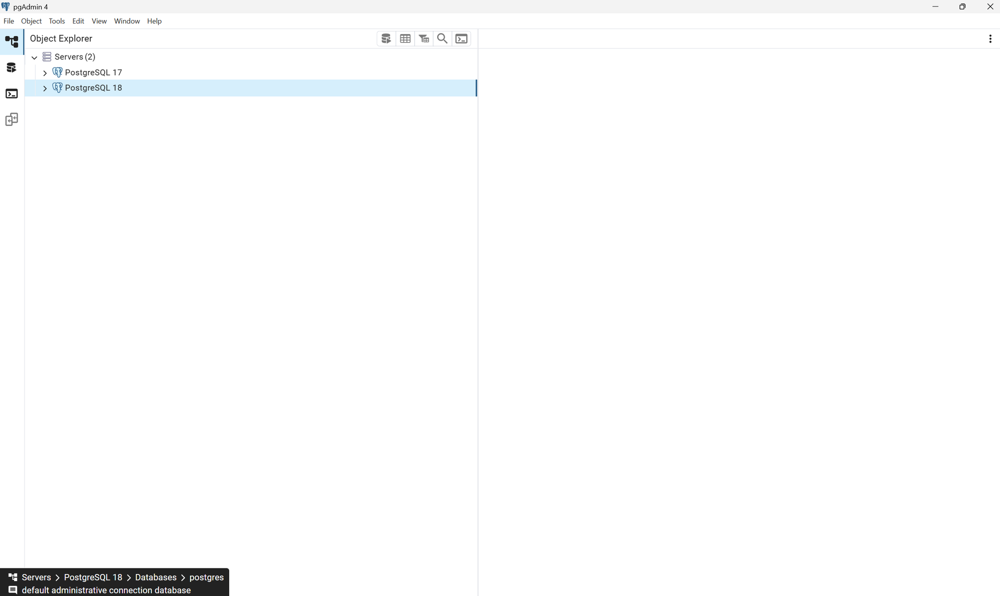
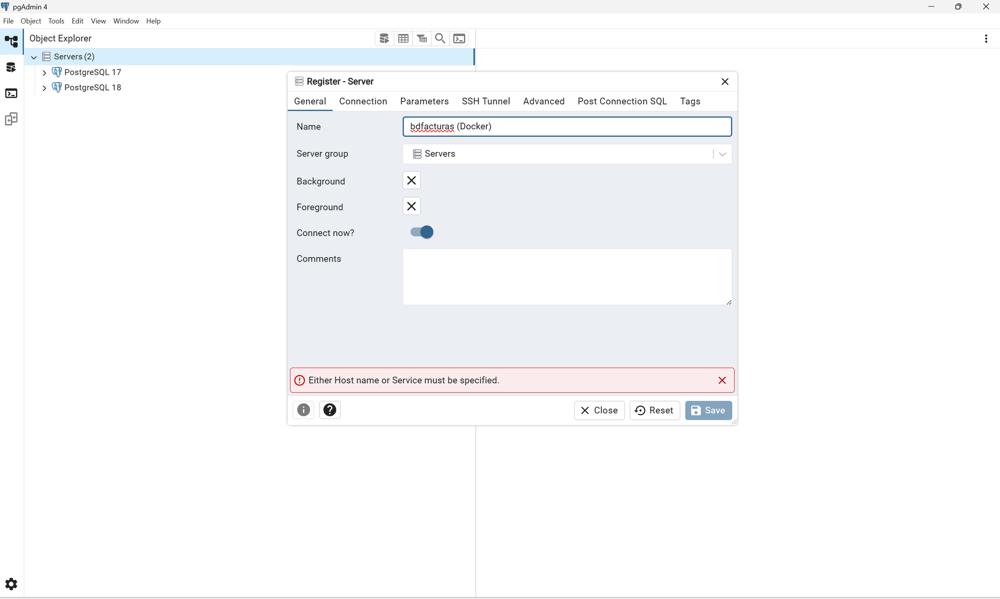
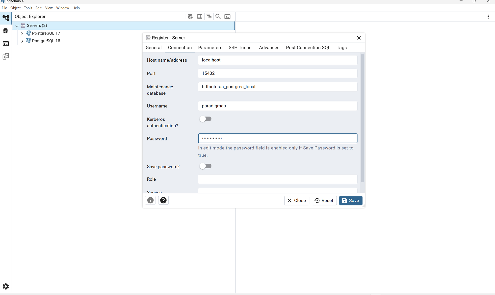
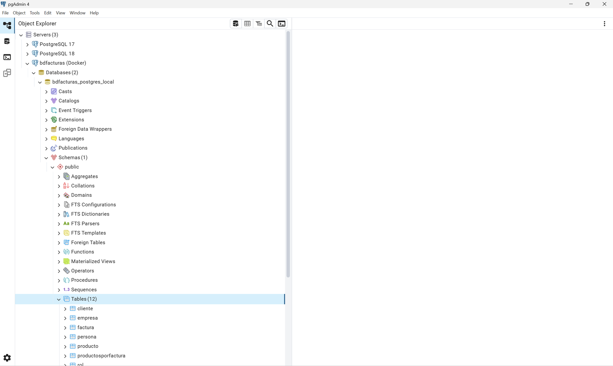
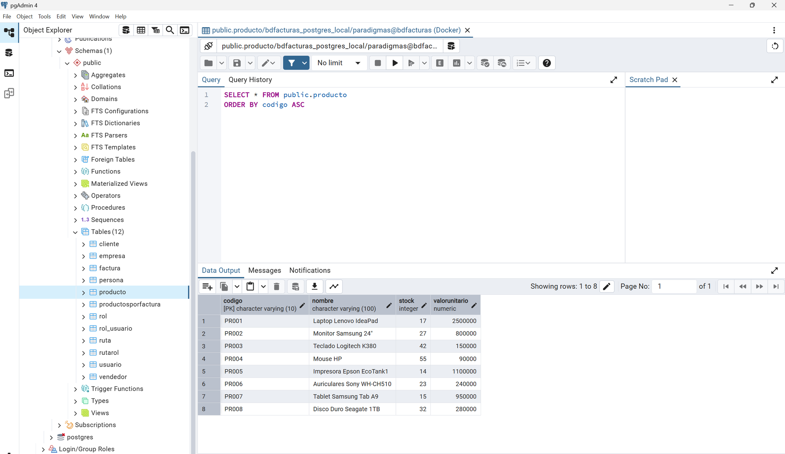
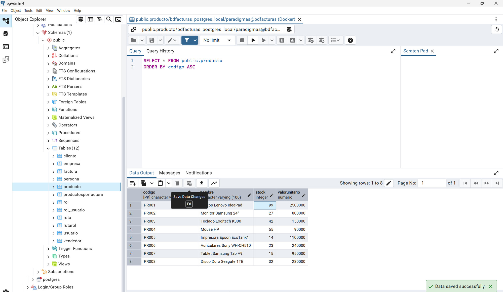
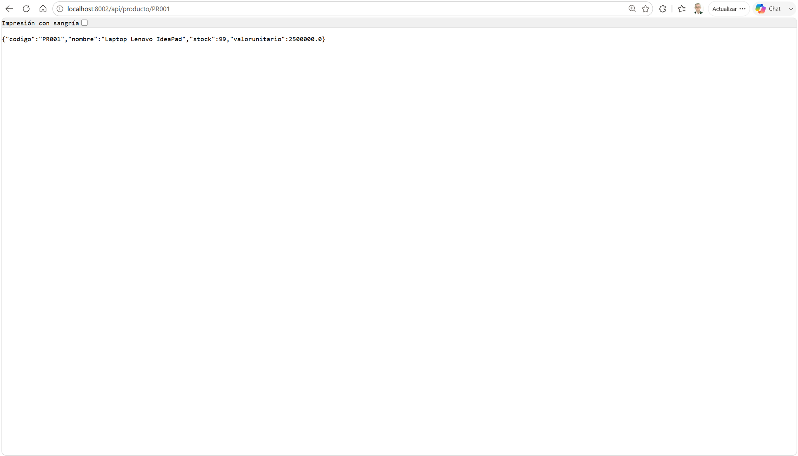
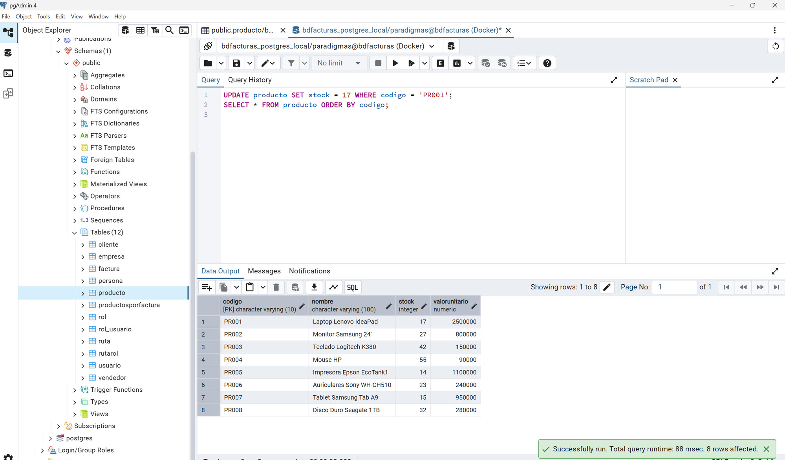
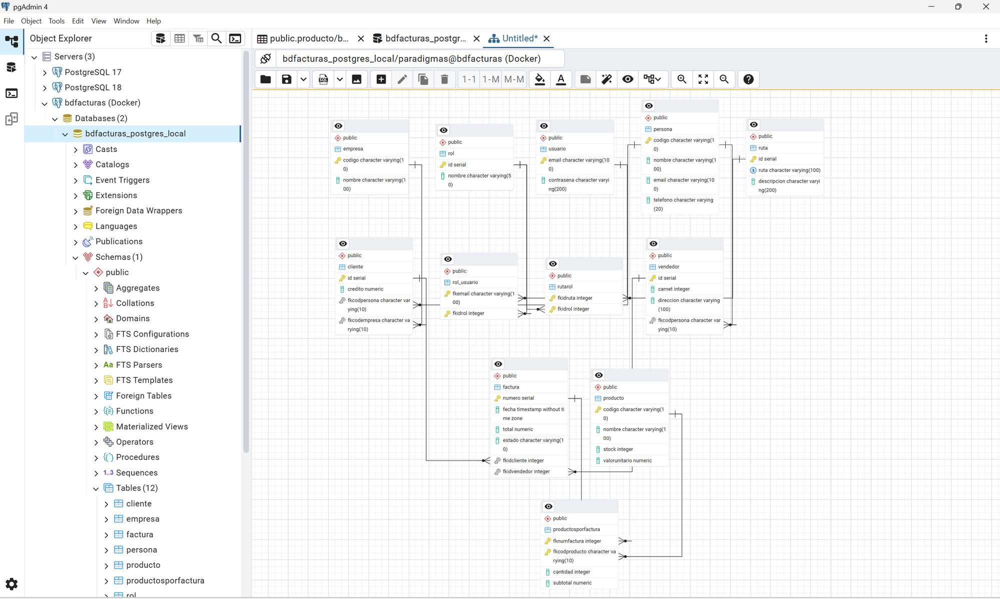

# Tutorial — Administrar la base de datos con pgAdmin

> Paso a paso para conectarse a la BD `bdfacturas` del proyecto (la que corre
> en Docker) usando **pgAdmin 4**, explorarla, consultarla y modificarla — y
> ver cómo cada cambio se refleja al instante en la API.
>
> **Prerrequisitos:** el proyecto corriendo (`docker compose up -d` desde la
> raíz — ver el [README](../README.md)) y pgAdmin 4 instalado
> (<https://www.pgadmin.org/download/>).

---

## Paso 0 — Abrir pgAdmin

Abra pgAdmin 4. En el panel izquierdo (**Object Explorer**) verá el nodo
`Servers` — puede que ya tenga servidores registrados (por ejemplo, un
PostgreSQL instalado localmente). **Ninguno de esos es la BD del proyecto**:
la nuestra corre en un contenedor Docker y hay que registrarla aparte.



> Dato importante: la BD del contenedor publica el puerto **15439** en su PC
> (no el 5432 clásico) precisamente para NO chocar con un PostgreSQL local
> como los que quizá ve en su lista.

## Paso 1 — Registrar el servidor del proyecto

Clic **derecho** sobre `Servers` → **Register** → **Server…**

En la pestaña **General**, escriba el nombre con el que verá este servidor en
su lista: `bdfacturas (Docker)`.



> ⚠️ Si en este punto intenta dar **Save**, pgAdmin le mostrará el aviso rojo
> *"Either Host name or Service must be specified"* (visible en la captura).
> No es un error suyo: significa que falta llenar la pestaña **Connection** —
> el nombre es solo la etiqueta; la conexión real va en la otra pestaña.

Pase a la pestaña **Connection** y llene exactamente estos valores (son los
declarados en el `docker-compose.yml` del proyecto):

| Campo | Valor | Por qué |
|---|---|---|
| Host name/address | `localhost` | El contenedor publica su puerto en SU PC |
| Port | `15439` | El puerto publicado (no el 5432 clásico, para no chocar con un PostgreSQL local) |
| Maintenance database | `bdfacturas_postgres_local` | La BD que creó `db/init.sql` |
| Username | `paradigmas` | Usuario declarado en el compose |
| Password | `paradigmas123` | Clave declarada en el compose (didáctica a propósito) |
| Save password? | ✓ activado | Para no digitarla en cada sesión |



Clic en **Save**: el servidor `bdfacturas (Docker)` aparece en la lista y se
conecta (ícono de enchufe conectado).

## Paso 2 — Explorar la base de datos (las 12 tablas)

Expanda en el Object Explorer:

```
bdfacturas (Docker) → Databases → bdfacturas_postgres_local
    → Schemas → public → Tables (12)
```



Ahí están las 12 tablas de `bdfacturas`: `cliente`, `empresa`, `factura`,
`persona`, `producto`, `productosporfactura`, `rol`, `rol_usuario`, `ruta`,
`rutarol`, `usuario`, `vendedor`.

Dos observaciones para la clase:

- **La BD está completa desde la v1** aunque la API solo use `producto` — es
  la decisión documentada en el
  [modelo de datos de la v1](spec_kit/versiones/v1_producto_postgres/5_data_model.md).
- De paso, mire los otros nodos bajo `public`: **Functions** y **Procedures**
  (los SPs de facturación que usarán versiones futuras), **Sequences** (los
  autoincrementales de las PK `SERIAL`) y, dentro de cada tabla, sus
  **Constraints** (PK, FK, UNIQUE).

## Paso 3 — Ver los datos de una tabla

Clic **derecho** sobre la tabla `producto` → **View/Edit Data** → **All Rows**.



Tres cosas para notar en esta pantalla:

1. **pgAdmin no hace magia: hace SQL.** Arriba se ve la consulta que generó
   por usted (`SELECT * FROM public.producto ORDER BY codigo ASC`) — todo lo
   que la interfaz hace se puede escribir a mano (Paso del Query Tool).
2. **Los encabezados enseñan el esquema**: `codigo [PK] character varying(10)`,
   `stock integer`, `valorunitario numeric` — la grilla muestra tipos y llaves,
   no solo datos.
3. **Son los mismos 8 productos** que responde la API en
   `GET /api/producto` — pgAdmin y la API son dos puertas a la MISMA tabla.
   Eso se demuestra en el paso siguiente.

## Paso 4 — Editar un dato directamente en la BD

En la grilla del paso anterior:

1. **Doble clic** en la celda `stock` del producto `PR001` (dice `17`).
2. Escriba `99` y presione Enter — la celda queda marcada como pendiente.
3. Guarde con el botón **Save Data Changes** de la barra de la grilla
   (o la tecla **F6**). Abajo a la derecha aparece la confirmación verde
   *"Data saved successfully"*.



> Detalle técnico: al guardar, pgAdmin ejecutó por usted un
> `UPDATE producto SET stock = 99 WHERE codigo = 'PR001'` — la grilla
> editable es solo una cara amable del SQL de siempre.

## Paso 5 — Ver el cambio a través de la API

Abra en el navegador: **http://localhost:8021/api/producto/PR001**



La API responde `"stock": 99` — el valor que usted acaba de escribir desde
pgAdmin. **Esta es la moraleja del tutorial:** pgAdmin y la API son dos
puertas a la MISMA tabla. No existen "los datos de pgAdmin" y "los datos de
la API": existe UNA base de datos, y todo lo que la toca (la API con SQL
parametrizado, pgAdmin con su grilla, el Query Tool con SQL a mano) ve y
modifica lo mismo.

## Paso 6 — Escribir SQL a mano (Query Tool) y deshacer el cambio

Ahora devolvemos el stock a su valor original, pero **escribiendo el SQL
nosotros**:

1. Clic sobre la base `bdfacturas_postgres_local` en el árbol.
2. Menú **Tools → Query Tool** (se abre una pestaña con editor SQL).
3. Escriba y ejecute con **F5**:

```sql
UPDATE producto SET stock = 17 WHERE codigo = 'PR001';
SELECT * FROM producto ORDER BY codigo;
```



En **Data Output** aparece PR001 de nuevo con stock `17`, y abajo la
confirmación *"Successfully run"*. El punto didáctico: lo que la grilla hizo
por usted en el Paso 4 (un `UPDATE`), ahora lo escribió usted — pgAdmin es
solo una interfaz sobre SQL. El Query Tool es la herramienta de verdad del
administrador: todo lo demás son atajos.

## Paso 7 — El diagrama ERD que pgAdmin genera solo

Clic **derecho** sobre la base `bdfacturas_postgres_local` →
**ERD For Database**.



pgAdmin dibuja el **diagrama entidad-relación de las 12 tablas** leyendo la
BD real (ingeniería inversa): cada caja muestra columnas con sus tipos, las
llaves (🔑 = PK) y los conectores son las FK. Ubique en el diagrama las
relaciones que el curso usa como ejemplo:

- `persona` ← `cliente` → `empresa` (un cliente ES una persona, respaldada
  por una empresa opcional).
- `factura` → `cliente` y `factura` → `vendedor`.
- `productosporfactura` conecta `factura` ↔ `producto` (la relación N:M del
  detalle, con PK compuesta).
- El triángulo de seguridad: `usuario` ↔ `rol_usuario` ↔ `rol` ↔ `rutarol` ↔
  `ruta`.

Compare este diagrama con el del
[modelo de datos de la v1](spec_kit/versiones/v1_producto_postgres/5_data_model.md):
es el mismo modelo — uno viene de la spec, el otro de la BD viva. Cuando
coinciden, la spec no miente.

---

## Cierre — lo que acaba de aprender

| Paso | Habilidad |
|---|---|
| 1 | Registrar una conexión (host/puerto/credenciales — y leer el error cuando falta algo) |
| 2 | Navegar la estructura: tablas, funciones, procedimientos, secuencias, constraints |
| 3 | Ver datos (y descubrir que la interfaz genera SQL) |
| 4 | Modificar datos desde la grilla (UPDATE disfrazado) |
| 5 | Comprobar que la BD es UNA: el cambio aparece en la API al instante |
| 6 | Escribir SQL a mano en el Query Tool (la herramienta de verdad) |
| 7 | Generar el ERD por ingeniería inversa y leerlo |

**Advertencias finales:**

- Todo lo que edite aquí es **real**: no hay "modo práctica". Si daña los
  datos, el reset es `docker compose down -v` + `docker compose up -d`
  (la BD renace desde `db/init.sql`).
- pgAdmin se conecta al puerto **15439** (el publicado por el compose). Si no
  conecta, primero verifique que el proyecto esté corriendo:
  `docker compose ps`.
- Las credenciales de este proyecto son didácticas y públicas a propósito
  (ver la [constitución](spec_kit/1_constitution.md), Artículo 8) — en un
  sistema real, jamás viajan en un tutorial.
