# Tutorial — Administrar la base de datos desde VS Code (SQLTools)

> Paso a paso para conectarse a la BD `bdfacturas` del proyecto **sin salir de
> VS Code**, usando la extensión **SQLTools**. Es la alternativa liviana a
> pgAdmin ([tutorial aquí](TUTORIAL_PGADMIN.md)): mismo SQL, misma BD, pero en
> el editor donde ya está su código — ideal para consultar mientras programa.
>
> **Prerrequisitos:** el proyecto corriendo (`docker compose up -d` desde la
> raíz — ver el [README](../README.md)) y VS Code abierto en la carpeta del
> proyecto.

---

## Paso 1 — Instalar SQLTools y su driver de PostgreSQL

Abra la vista de **Extensiones** (`Ctrl+Shift+X`) y busque `sqltools`.
Instale **dos** extensiones (ambas de Matheus Teixeira):

1. **SQLTools** (`mtxr.sqltools`) — el administrador de bases de datos.
2. **SQLTools PostgreSQL/Cockroach Driver** — el conector para PostgreSQL.

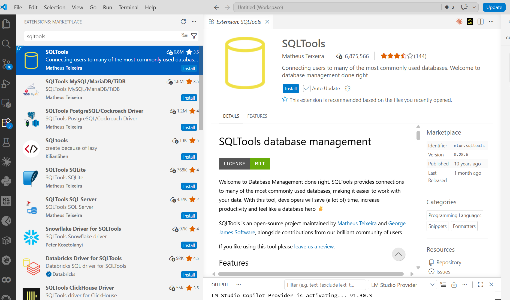

> ¿Por qué dos? SQLTools funciona con **drivers por motor** — el mismo patrón
> del proyecto: un núcleo genérico + un adaptador por base de datos. En la
> lista se ven los demás drivers (MySQL/MariaDB, SQL Server, SQLite…): cuando
> la v3 y la v4 agreguen motores, se instalará el driver correspondiente y
> TODO lo demás de este tutorial seguirá igual.

Al instalar el driver, VS Code muestra **"Restart Required"** en la fila de la
extensión (y un contador en el ícono de Extensiones):

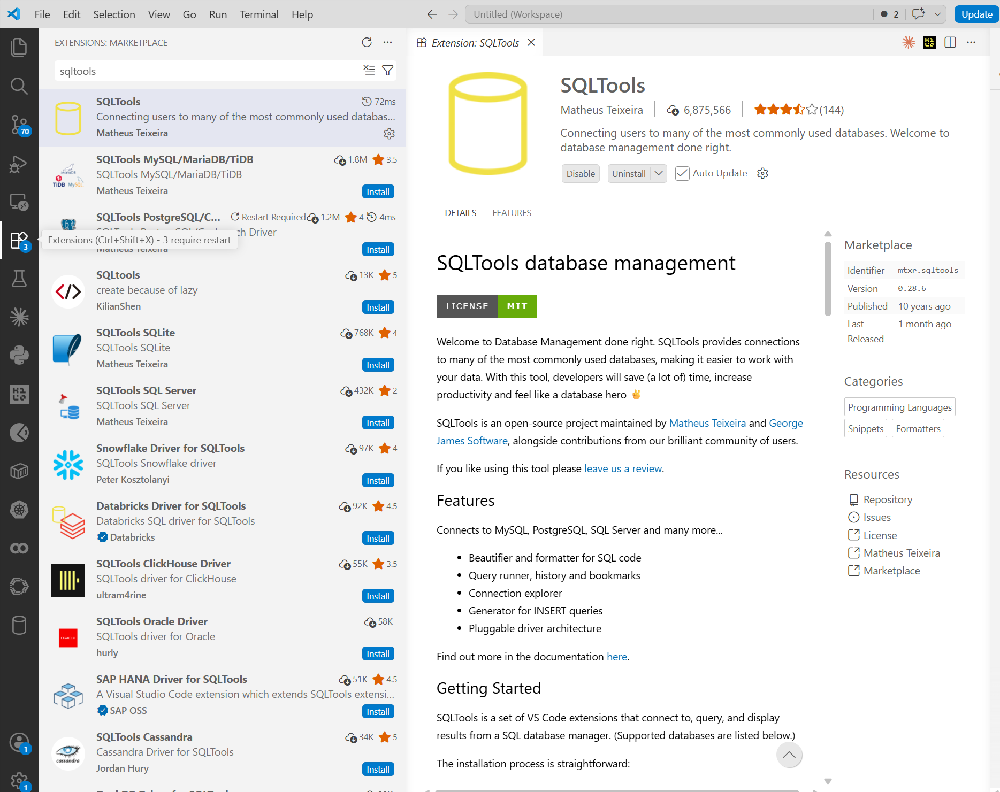

Haga clic en ese *Restart Required* (o `Ctrl+Shift+P` → `Reload Window`): la
ventana se recarga en segundos y no se pierde nada. Al volver, aparece el
**ícono de cilindro** (base de datos) en la barra lateral izquierda — es
SQLTools:


> ⚠️ **El tropiezo clásico:** si instala solo SQLTools y da *Add New
> Connection*, el asistente se queda pegado en *"Couldn't find any installed
> drivers — Try installing drivers before proceeding"*:
>
> 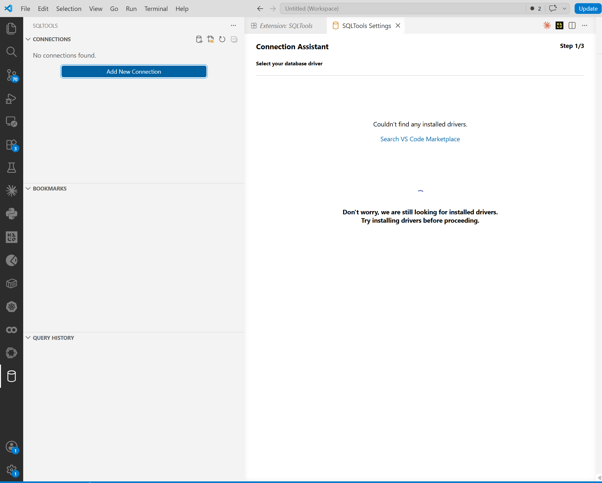
>
> No es un error de la BD ni del proyecto: **falta la segunda extensión** (el
> driver de PostgreSQL). Se resuelve así, sin salir de VS Code:
>
> 1. **Cierre la pestaña** del asistente atascado ("SQLTools Settings").
> 2. Vuelva a **Extensiones** (`Ctrl+Shift+X`), busque `sqltools` e instale
>    **SQLTools PostgreSQL/Cockroach Driver**.
> 3. Recargue la ventana: `Ctrl+Shift+P` → escriba `Reload Window` → Enter.
>    (El asistente NO detecta drivers instalados después de abrirse — la
>    recarga es obligatoria y no pierde nada.)
> 4. Clic en el cilindro → **Add New Connection** — ahora sí aparece
>    PostgreSQL 🐘 como opción.

## Paso 2 — Crear la conexión a la BD del proyecto

Clic en el **cilindro** de la barra lateral → **Add New Connection**. El
asistente (*Connection Assistant*, 3 pasos) muestra los drivers instalados —
elija **PostgreSQL**:

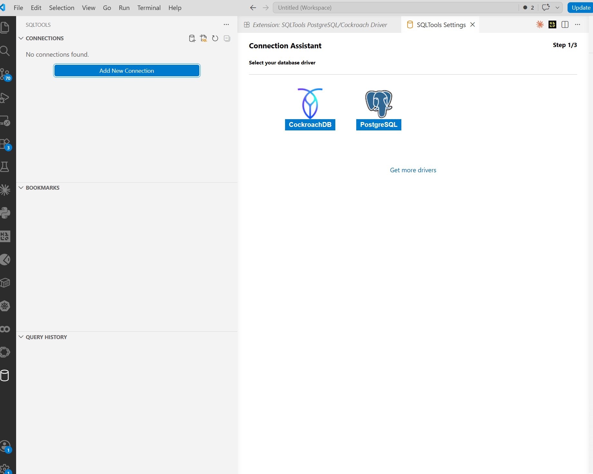

En el formulario (*Step 2/3*) llene exactamente estos valores (son los del
`docker-compose.yml` del proyecto):

| Campo | Valor |
|---|---|
| Connection name | `bdfacturas (Docker)` |
| Connect using | `Server and Port` |
| Server Address | `localhost` |
| Port | `15439` |
| Database | `bdfacturas_postgres_local` |
| Username | `paradigmas` |
| Use password | **Save as plaintext in settings** |
| Password | `paradigmas123` |

El resto de opciones (SSL, timeouts, SSH) se dejan como están.

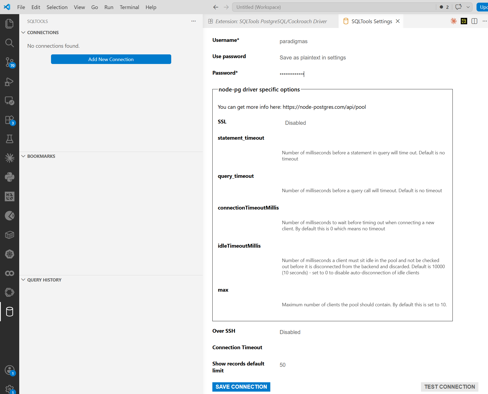

> ¿Por qué "Save as plaintext in settings"? Para no digitar la clave en cada
> conexión. Es aceptable AQUÍ porque la credencial es didáctica y pública
> (constitución, Artículo 8) — con una credencial real usaría "Ask on
> connect" o un gestor de secretos, nunca texto plano.

Clic en **SAVE CONNECTION**. El paso 3/3 confirma y muestra algo muy
revelador — **el JSON de la conexión** que acaba de quedar guardado en los
settings de VS Code, contraseña incluida:

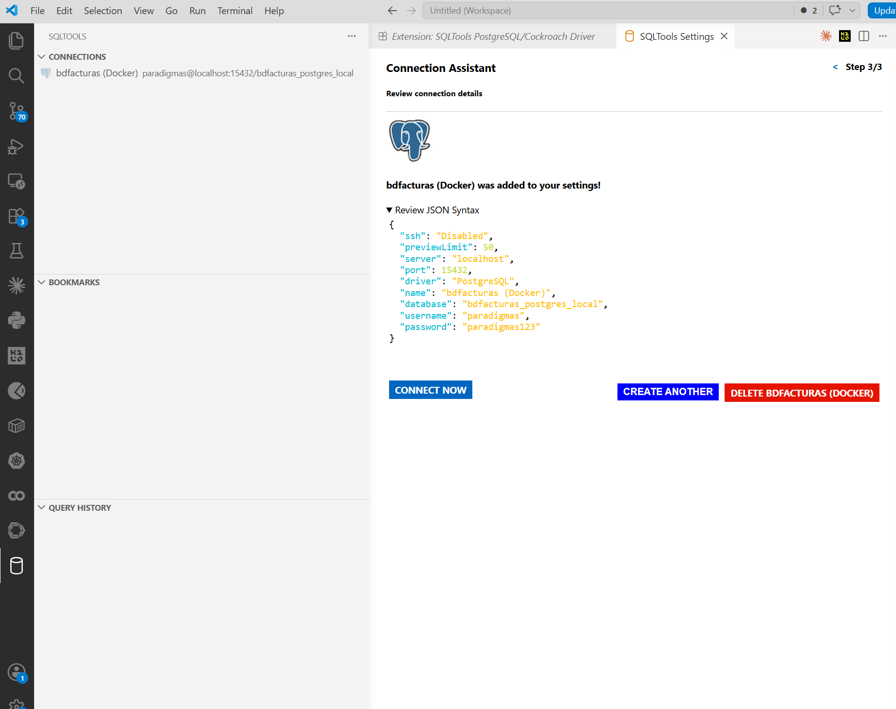

> Ahí está la lección de "plaintext": la configuración de VS Code es un JSON
> más (`settings.json`), y cualquiera que abra ese archivo ve la clave. Por
> eso jamás se hace con credenciales reales.

Termine con **CONNECT NOW**: la conexión queda activa en el panel izquierdo.

## Paso 3 — Explorar la base de datos

Con la conexión activa (punto verde), expanda en el panel **CONNECTIONS**:

```
bdfacturas (Docker) → bdfacturas_postgres_local → Schemas → public → Tables
```

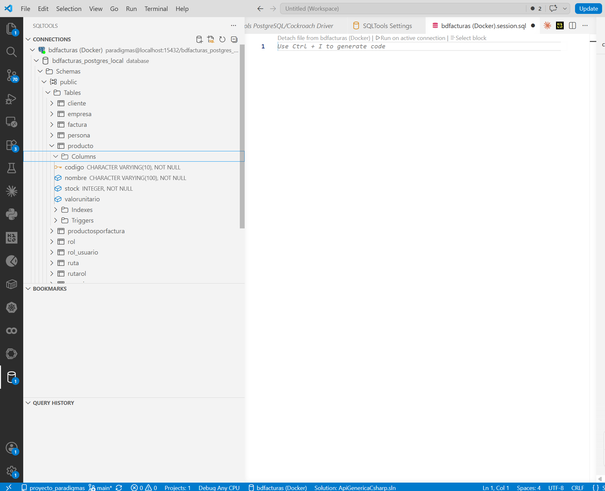

Ahí están las **12 tablas** de `bdfacturas`. Expanda `producto` → **Columns**:
SQLTools muestra cada columna con su tipo y restricciones
(`codigo CHARACTER VARYING(10), NOT NULL` — con el ícono de llave: es la PK),
más sus **Indexes** y **Triggers**.

Dos detalles:

- Al conectar, SQLTools abrió una pestaña **`bdfacturas (Docker).session.sql`**
  — es su editor SQL ya conectado a la BD; ahí se escribe en el paso siguiente.
- Es la misma BD que administró con pgAdmin
  ([tutorial](TUTORIAL_PGADMIN.md)) y que consume la API: tres puertas, UNA
  base de datos.

## Paso 4 — Consultar con SQL

En la pestaña **`bdfacturas (Docker).session.sql`** escriba:

```sql
SELECT * FROM producto ORDER BY codigo;
```

y ejecute con **`▷ Run on active connection`** (el enlace sobre el archivo).

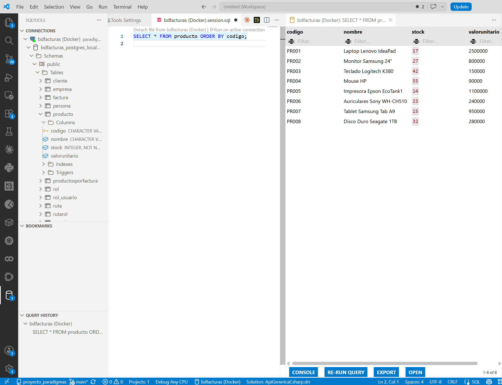

El panel de resultados muestra los 8 productos, y trae más de lo que parece:

- **Filter…** en cada columna: filtrado local sin re-consultar.
- **EXPORT**: descarga el resultado como CSV o JSON.
- **RE-RUN QUERY** y el panel **QUERY HISTORY** (abajo a la izquierda): el
  historial de todo lo que ha ejecutado.
- El archivo `.session.sql` es un archivo normal: puede guardarlo con sus
  consultas favoritas (aunque es temporal por defecto — no lo suba al repo).

## Paso 5 — Insertar y eliminar con SQL

En el mismo `session.sql`, escriba y ejecute:

```sql
INSERT INTO producto (codigo, nombre, stock, valorunitario)
VALUES ('PR009', 'Webcam Logitech', 5, 120000);
SELECT * FROM producto ORDER BY codigo;
```

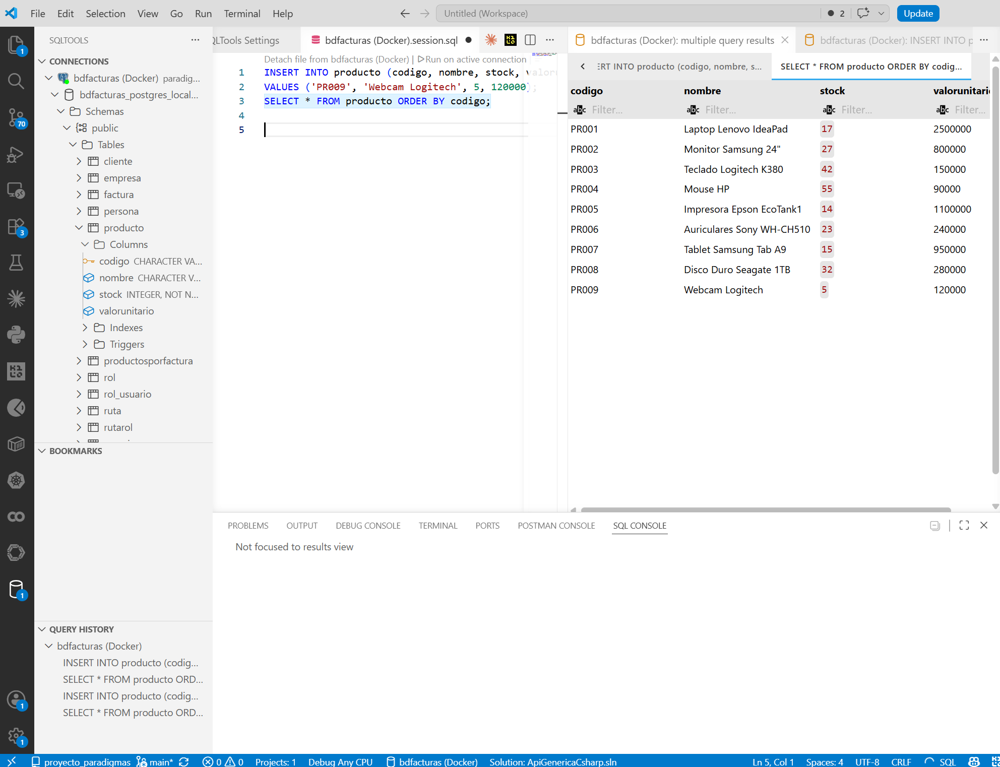

La grilla muestra **9 filas** — PR009 quedó en la BD. Observe que al ejecutar
el archivo con dos sentencias, SQLTools abre **una pestaña de resultados por
sentencia** ("multiple query results").

> 💡 **¿Cómo ejecutar UNA sola sentencia de varias?** Selecciónela con el
> mouse y presione **`Ctrl+E` `Ctrl+E`** (o clic derecho → *Run Selected
> Query*): SQLTools ejecuta solo lo resaltado. El enlace
> `▷ Run on active connection` ejecuta el archivo COMPLETO.

Compruebe el otro lado de la moneda: abra
`http://localhost:8021/api/producto/PR009` en el navegador — la API responde
la webcam que usted insertó por SQL (misma BD, otra puerta).

Y para dejar todo como estaba, seleccione y ejecute solo esta línea:

```sql
DELETE FROM producto WHERE codigo = 'PR009';
```

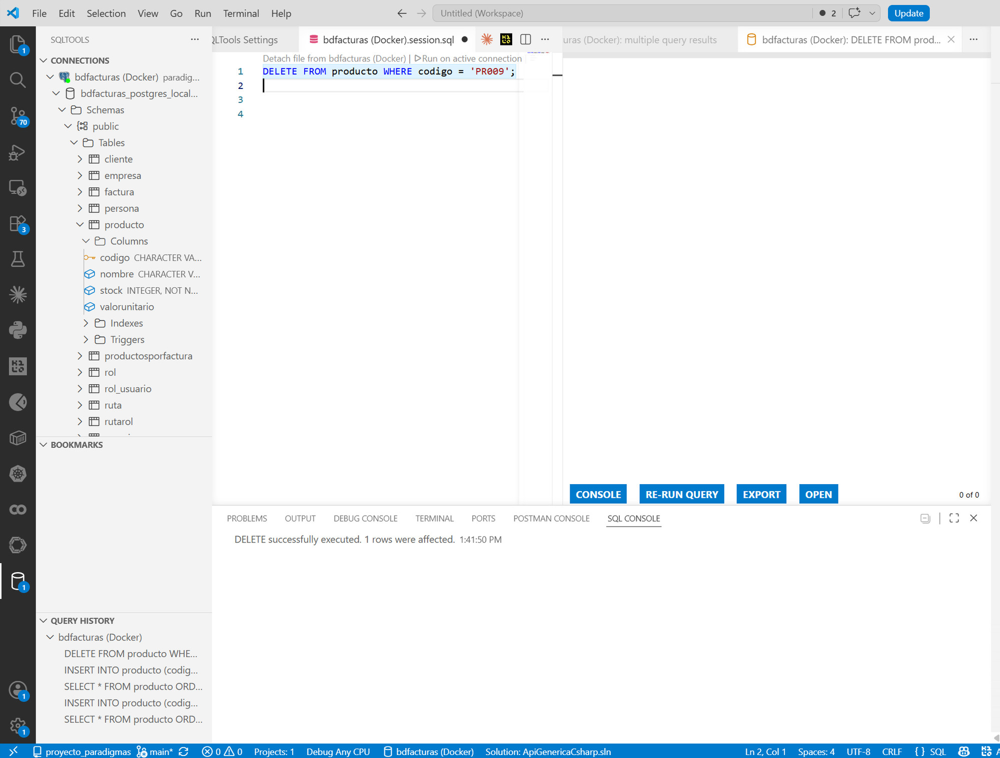

La consola SQL confirma *"DELETE successfully executed. 1 rows were
affected"*. Un último SELECT verifica que volvieron a ser 8:

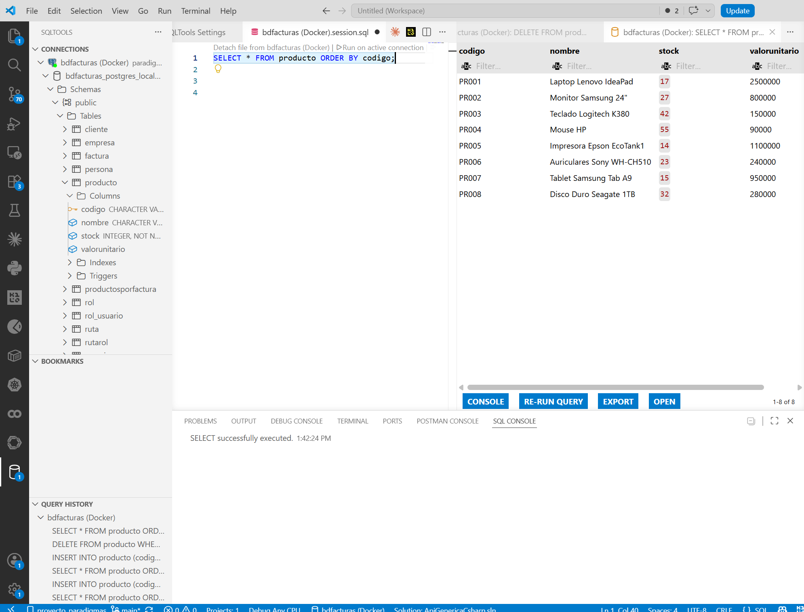

---

## Cierre — pgAdmin vs SQLTools: ¿cuál usar?

| | **pgAdmin** | **SQLTools** |
|---|---|---|
| Dónde vive | Aplicación aparte | Dentro de VS Code |
| Fuerte en | Administración profunda: ERD, grilla editable, backups, estadísticas | Consultar SIN salir del editor mientras programa |
| Grilla editable | Sí (doble clic + F6) | No — todo cambio es SQL explícito |
| Motores | Solo PostgreSQL | El que tenga driver (PostgreSQL, MariaDB, SQL Server… — útil en v3/v4) |
| Para este curso | El tutorial de administración completa ([aquí](TUTORIAL_PGADMIN.md)) | La herramienta del día a día mientras construye la API |

**Lo que acaba de aprender:** instalar extensión + driver (y el reinicio
requerido), crear una conexión (y por qué "plaintext" solo con credenciales
didácticas), explorar el esquema, consultar con SELECT, ejecutar una
sentencia entre varias (`Ctrl+E Ctrl+E` con selección), e INSERT/DELETE con
verificación en la API.

**Advertencias finales:**

- Todo lo que ejecute aquí es **real** — el reset de la BD es
  `docker compose down -v` + `docker compose up -d`.
- El archivo `*.session.sql` es temporal de SQLTools: **no lo suba al
  repositorio**.
- Si la conexión falla, primero verifique que el proyecto esté corriendo:
  `docker compose ps`.
