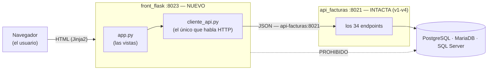

# Especificación — Versión 5: el front NACE

> **Versión 5** ([mapa](../0_mapa_versiones.md)) · Rige la
> [constitución](../../1_constitution.md). **Acumulativa:** la API v1–v4
> (tri-motor, 34 endpoints) **NO se toca** — la v5 le pone encima su primer
> cliente visual.
>
> | Documento | Contenido |
> |---|---|
> | [2_spec.md](2_spec.md) | QUÉ agrega la v5 y sus criterios |
> | [3_plan.md](3_plan.md) | CÓMO: la arquitectura del front |
> | [4_research.md](4_research.md) | Las decisiones, con lo que se descartó |
> | [5_data_model.md](5_data_model.md) | El front **no tiene datos propios** |
> | [6_contracts.md](6_contracts.md) | Las PANTALLAS: el contrato del front |
> | [7_quickstart.md](7_quickstart.md) | Arranque y smoke test |
> | [8_tasks.md](8_tasks.md) | El orden de construcción por fases |
> | [9_checklist.md](9_checklist.md) | La compuerta 3: se firma ANTES de programar |
> | [GUIA_IA5.md](GUIA_IA5.md) | Construirla con ayuda de una IA |

---

## 1. Propósito

Estrenar la **capa de presentación** del sistema: una aplicación web Flask +
Jinja2 (`front_flask/`, puerto **8023**) que habla con la API por HTTP y
**jamás** con la base de datos.

Hasta la v4, la separación de capas era **interna**: dentro del mismo proceso
había controladores, servicios y repositorios. La v5 saca esa separación
**afuera**: el front es otro proceso, otra imagen, otro puerto — y no tiene
forma de llegar a los datos como no sea preguntándole a la API.

Como la v1 hizo con la API, la v5 construye **UNA rebanada completa** del
front: producto.

## 2. Alcance

**Incluye**

- `front_flask/` como servicio propio del compose, en el puerto 8023.
- Las pantallas de **producto**: listar, crear, editar y eliminar.
- **La pareja PUT/PATCH visible**: la misma pantalla de edición, dos botones.
- Los errores de la API (400, 404, 422, 500) traducidos a avisos en pantalla.
- El caso **API caída**, que también es una pantalla y no un derrumbe.

**NO incluye** — y no se anticipa nada de esto

- Las otras cinco entidades (persona, empresa, cliente, vendedor, factura):
  son el mismo patrón repetido, y entran en la versión siguiente.
- **Login.** No por decisión de diseño, sino por un hecho verificable: la API
  de la v4 expone seis controladores y **ninguno de `usuario`**. Un login
  exigiría abrir un endpoint nuevo, y eso es tocar la API — que la regla 3 del
  mapa prohíbe. Ver [4_research §D4](4_research.md).
- JavaScript de framework. Todo se renderiza en el servidor.
- Validación propia en el front. Ver [4_research §D2](4_research.md).

## 3. Requisitos funcionales

### RF1 — Listar
`GET /productos` muestra la tabla con lo que devuelve `GET /api/producto`.
- Si la API responde **204**, la pantalla dice **"no hay productos todavía"**
  con un mensaje neutro: la tabla vacía no es un error.
- Si la API no responde, se muestra la página **con un aviso**, no una
  excepción de Flask.

### RF2 — Crear
`GET /productos/nuevo` muestra el formulario; el `POST` lo envía a
`POST /api/producto`.
- Éxito → vuelve al listado con el aviso verde.
- **422** → vuelve al formulario **conservando lo digitado**, con el error de
  la API arriba.

### RF3 — Reemplazar (PUT)
En `/productos/<codigo>/editar`, el botón **"Reemplazar (PUT)"** envía los
tres campos aunque estén vacíos. Un campo en blanco responde **422**.

### RF4 — Actualizar (PATCH)
En **la misma pantalla**, el botón **"Actualizar lo diligenciado (PATCH)"**
envía solo los campos con contenido.
- El **mismo formulario** que el PUT rechaza, aquí responde **200**.
- Si no se diligenció ninguno, el front no llama a la API: avisa y se queda.

### RF5 — Eliminar
`POST /productos/<codigo>/eliminar` llama a `DELETE`, con confirmación previa
en el navegador. **Va por POST y no por enlace**: un GET que borra lo puede
disparar el navegador solo al precargar la página.

## 4. Requisitos no funcionales

- **Un solo comando** levanta los seis servicios (Artículo 4).
- **El front no conoce ninguna cadena de conexión.** Su única variable de
  entorno hacia afuera es `API_FACTURAS_URL`.
- Todo en español: rutas, plantillas, avisos y comentarios (Artículo 8).
- Sin framework de CSS: la presentación son 40 líneas escritas a mano.

## 5. Criterios de aceptación

1. **Un solo comando.** `docker compose up -d --build` deja arriba los seis
   servicios. `http://localhost:8023` redirige al listado y responde 200.
2. **Crear desde el navegador.** Un producto creado en el formulario aparece
   en el listado **y lo devuelve la API** en `GET /api/producto/<codigo>`.
3. **El 422 se ve en pantalla.** Escribir letras en el stock devuelve el
   formulario con el mensaje de la API, y **el producto no se crea**
   (`GET` responde 404).
4. **La pareja PUT/PATCH.** Con el nombre en blanco: el botón PUT deja la
   pantalla con un 422; el botón PATCH, sobre **el mismo formulario**,
   guarda y vuelve al listado.
5. **PATCH sin nada** avisa y no llama a la API.
6. **Eliminar** saca el producto del listado y la API responde 404.
7. **La prueba de la versión.** Con `docker compose stop api-facturas`, la
   pantalla `/productos` **sigue cargando** y muestra
   *"El servicio no está disponible"* — **sin datos**. Si el front pudiera
   llegar a la base por otro camino, este criterio no se podría cumplir.

## 6. Clarificaciones

| # | La pregunta | La respuesta, con su razón |
|---|---|---|
| C1 | ¿El front valida antes de enviar? | **No.** La regla ya vive en Pydantic; repetirla aquí le daría dos dueños, y el día que cambie una sola, el sistema miente. Ver [D2](4_research.md) |
| C2 | ¿Los campos numéricos usan `type="number"`? | **No.** El navegador rechazaría `abc` antes de enviarlo y **el 422 nunca se vería** — que es justo lo que hay que mostrar |
| C3 | ¿Login? | **No en la v5.** La API no expone `usuario`; ver [D4](4_research.md) |
| C4 | ¿Y si la API está caída? | Es **una pantalla**, no una excepción: la página carga y el aviso lo explica |
| C5 | Un 422, ¿pierde lo digitado? | **No.** El formulario vuelve con los valores puestos |
| C6 | ¿Qué hace `/`? | Redirige a `/productos`, lo único que existe en esta versión |

## 7. Definición de TERMINADA

1. Los **7 criterios** pasan, corridos por una persona
   ([7_quickstart](7_quickstart.md)).
2. [9_checklist.md](9_checklist.md) está en verde y **firmada**.
3. La API v1–v4 quedó **sin un solo cambio**.
4. Commit y **tag `v5`**.
