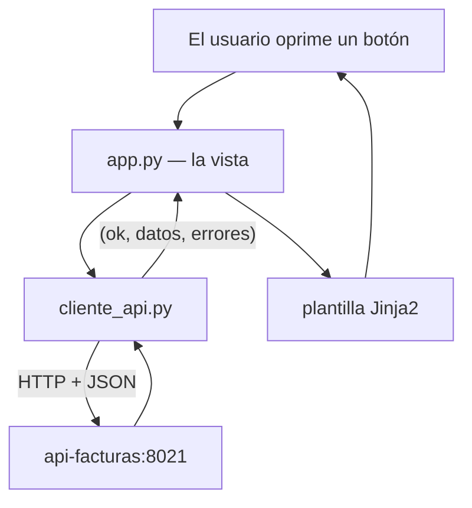

# Plan — Versión 5: cómo se arma el front

> **Versión 5** ([mapa](../0_mapa_versiones.md)) · Rige la
> [constitución](../../1_constitution.md). **Acumulativa:** la API v1–v4
> (tri-motor, 34 endpoints) **NO se toca** — la v5 le pone encima su primer
> cliente visual.
>
> | Documento | Contenido |
> |---|---|
> | [2_spec.md](2_spec.md) | QUÉ agrega la v5 y sus criterios |
> | [3_plan.md](3_plan.md) | CÓMO: la arquitectura del front |
> | [4_research.md](4_research.md) | Las decisiones, con lo que se descartó |
> | [5_data_model.md](5_data_model.md) | El front **no tiene datos propios** |
> | [6_contracts.md](6_contracts.md) | Las PANTALLAS: el contrato del front |
> | [7_quickstart.md](7_quickstart.md) | Arranque y smoke test |
> | [8_tasks.md](8_tasks.md) | El orden de construcción por fases |
> | [9_checklist.md](9_checklist.md) | La compuerta 3: se firma ANTES de programar |
> | [GUIA_IA5.md](GUIA_IA5.md) | Construirla con ayuda de una IA |

---

## 1. La estructura

```
front_flask/
├── app.py                        LAS VISTAS: qué pantalla responde a qué ruta
├── cliente_api.py                LA CAPA DE DATOS: el único que habla HTTP
├── templates/
│   ├── base.html                 el marco común: cabecera, avisos, pie
│   └── productos/
│       ├── lista.html            la tabla
│       └── formulario.html       crear Y editar: una sola plantilla
├── static/estilos.css            la presentación, a mano
├── requirements.txt              flask + requests. Nada más
└── Dockerfile                    imagen propia, separada de la API
```

## 2. La arquitectura: las mismas capas, otra vez

El front repite el patrón del back, y esa simetría es deliberada:

| En la API (v1–v4) | En el front (v5) | Su trabajo |
|---|---|---|
| `controllers/` | `app.py` | Recibe la petición y elige la respuesta |
| `servicios/` | *(no hay)* | **No hay negocio que poner aquí**: vive en la API |
| `repositorios/` | `cliente_api.py` | El único que sabe **dónde** están los datos |

Que la casilla del medio esté vacía **no es un olvido**: es el resultado de
haber decidido que el negocio tiene un solo dueño. Si mañana el front
empezara a decidir cosas, esa casilla se llenaría — y sería la señal de que
la regla se rompió.



## 3. Las decisiones de diseño

### 3.1 `cliente_api` devuelve `(ok, datos, errores)`

Ninguna vista sabe qué es un 422. Cada función traduce la respuesta HTTP a una
tupla, y `app.py` solo pregunta si salió bien.

### 3.2 Hay UNA sola forma de "no se pudo"… y dos causas

`_llamar()` devuelve `None` cuando **no hubo respuesta** —API caída, timeout—,
que es distinto de "respondió un error". Un 404 es la API funcionando y
diciendo que no existe; un `None` es que no hay con quién hablar. Esa
distinción es la que permite el criterio 7.

### 3.3 `_mensajes()` conoce **dos** formatos, porque la API produce dos

FastAPI anida siempre bajo `detail`, pero con formas distintas:

```python
# Los errores que la API escribe (400, 404, 500): un diccionario
{"detail": {"estado": 404, "mensaje": "…", "detalle": "…"}}

# Los 422: los genera Pydantic solo, y son una LISTA
{"detail": [{"loc": ["body", "stock"], "msg": "…", "type": "…"}]}
```

Que el front conozca las dos es exactamente su trabajo: **es la frontera**.
Las vistas reciben frases y no se enteran.

### 3.4 El verbo lo decide el botón, no un `if` de negocio

Los dos botones de la pantalla de edición son `submit` con el mismo `name` y
distinto `value`. Lo que cambia no es una regla: **es qué se envía**.

```python
if verbo == "put":
    # los tres campos, vacíos incluidos → un campo en blanco es 422
else:
    # solo los que tienen contenido
    parciales = {k: v for k, v in campos.items() if v != ""}
```

### 3.5 Los valores viajan **como texto**

`app.py` no convierte `stock` a entero. Si el usuario escribió `abc`, viaja
`abc` y la API responde 422. Convertirlo aquí sería adelantarse a la
validación — y taparía la lección.

## 4. Chequeo de constitución

> **La compuerta 2** del método: antes de programar, cada artículo se revisa
> contra este plan.

| Artículo | ¿Se respeta? | Cómo |
|---|---|---|
| 1 — No anticipar | ✅ | Solo producto. Las otras cinco entidades no se tocan |
| 2 — SQL a la vista y parametrizado | ✅ | El front **no escribe SQL**: no tiene acceso a la base |
| 3 — Capas con interfaces | ✅ | Vistas ↔ `cliente_api`. La capa de negocio no existe **a propósito** |
| 4 — Un solo comando | ✅ | El front entra al compose; sigue siendo `up -d --build` |
| 5 — La base es dada | ✅ | La v5 no toca la base ni el script |
| 6 — Los contratos se cumplen al pie de la letra | ✅ | El front consume los endpoints tal como los declara la v1 |
| 7 — Secretos | ✅ | `CLAVE_SESION` va en el compose, como las demás: la excepción declarada |
| 8 — Todo en español | ✅ | Rutas, plantillas, avisos y comentarios |

**Ningún artículo obliga a cambiar el plan.** La compuerta pasa.
