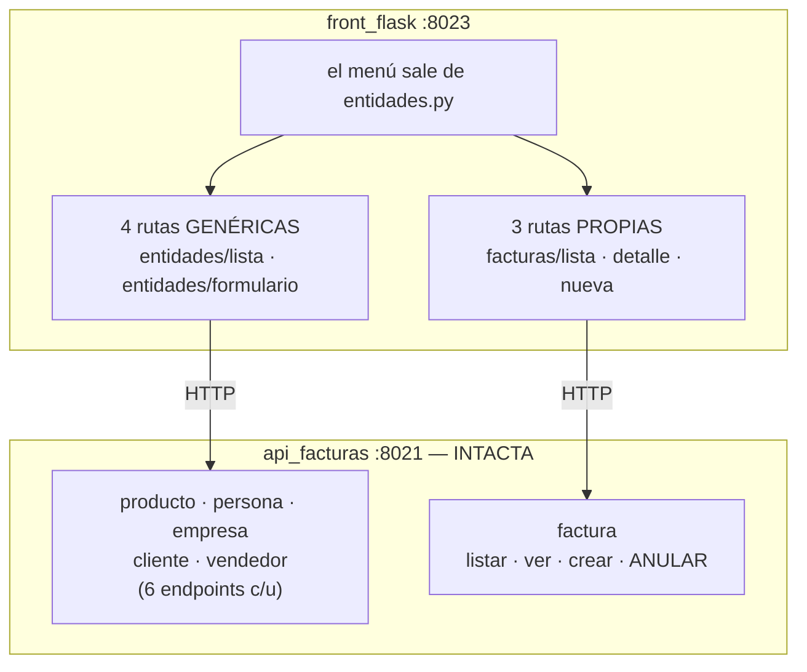

# Especificación — Versión 6: el front cubre las seis entidades

> **Versión 6** ([mapa](../0_mapa_versiones.md)) · Rige la
> [constitución](../../1_constitution.md). **Acumulativa:** la API v1–v4 y el
> front de la v5 **no se rompen** — la v6 extiende el front a las seis
> entidades.
>
> | Documento | Contenido |
> |---|---|
> | [2_spec.md](2_spec.md) | QUÉ agrega la v6 y sus criterios |
> | [3_plan.md](3_plan.md) | CÓMO: el front declarativo |
> | [4_research.md](4_research.md) | Las decisiones, con lo que se descartó |
> | [5_data_model.md](5_data_model.md) | El front sigue **sin datos propios** |
> | [6_contracts.md](6_contracts.md) | Las PANTALLAS de las seis entidades |
> | [7_quickstart.md](7_quickstart.md) | Arranque y smoke test |
> | [8_tasks.md](8_tasks.md) | El orden de construcción por fases |
> | [9_checklist.md](9_checklist.md) | La compuerta 3: se firma ANTES de programar |
> | [GUIA_IA6.md](GUIA_IA6.md) | Construirla con ayuda de una IA |

---

## 1. Propósito

La v5 dejó el front montado sobre **una** entidad. La v6 lo extiende a las
**seis**, y al hacerlo destapa dos cosas que con una sola no se veían:

1. **Que cinco entidades comparten el mismo CRUD** — y que repetir sus
   pantallas cinco veces sería el error, no la solución.
2. **Que la sexta NO lo comparte.** `factura` no tiene PUT, ni PATCH, ni
   DELETE. Y esa ausencia no es un olvido de la API: es una **regla contable
   convertida en contrato**.

## 2. Alcance

**Incluye**

- Un **menú** con las seis entidades.
- **Cuatro rutas genéricas** que sirven a las cinco entidades con CRUD, sobre
  una declaración en `entidades.py`.
- **Llaves foráneas como listas desplegables**: un cliente no digita el código
  de su persona, lo **elige** de las que existen. Las opciones también salen
  de la API.
- **Campos opcionales de verdad**: un opcional en blanco **no se envía**.
- Las **tres pantallas de factura**: la lista, el detalle maestro-detalle, y
  la creación con renglones.
- **Anular**, que no es borrar.

**NO incluye**

- Login ni roles: la API sigue sin exponer `usuario` (ver
  [4_research §D4 de la v5](../v5_front/4_research.md)).
- Editar o borrar una factura: **la API no lo ofrece**, y el front no le
  inventa endpoints.
- JavaScript para agregar renglones: la factura tiene cinco fijos.
- Búsqueda, paginación ni ordenamiento.

## 3. Requisitos funcionales

### RF1 — Un menú, seis entidades
Toda pantalla muestra el menú, y **sale de la misma declaración** que las
rutas: agregar una entidad no obliga a acordarse de tocar el menú.

### RF2 — CRUD genérico para las cinco
Cuatro rutas —`/<entidad>`, `/<entidad>/nuevo`, `/<entidad>/<llave>/editar`,
`/<entidad>/<llave>/eliminar`— sirven a producto, persona, empresa, cliente y
vendedor. Una URL que nombre una entidad inexistente responde **404**.

### RF3 — La pareja PUT/PATCH, ahora en las cinco
La pantalla de edición conserva sus dos botones. Con un campo en blanco: PUT
responde 422 y PATCH responde 200, **en cualquiera de las cinco**.

### RF4 — Las llaves foráneas se eligen
Los campos `fkcodpersona` y `fkcodempresa` se muestran como listas
desplegables cargadas desde la API. Si el catálogo está vacío, la pantalla lo
dice en vez de mostrar una lista vacía sin explicación.

### RF5 — Las llaves generadas no se piden
`cliente` y `vendedor` tienen llaves que genera la base. **No aparecen en el
formulario de creación**, y en el de edición se muestran sin poder cambiarse.

### RF6 — Los opcionales en blanco no se envían
`fkcodempresa` vacío **se omite del cuerpo**. Enviarlo como cadena vacía sería
decir "ponlo en vacío", que no es lo mismo que "no lo tiene".

### RF7 — Factura: listar, ver y crear
- `/facturas` lista con número, fecha, cliente, vendedor, total y estado.
- `/facturas/<numero>` muestra el **maestro y su detalle**, con el total que
  calculó la base.
- `/facturas/nueva` arma la factura eligiendo cliente, vendedor y hasta cinco
  renglones. Sin ningún renglón, el front avisa y no llama a la API.

### RF8 — Anular, que no es borrar
`/facturas/<numero>/anular` cambia el estado. **La factura sigue ahí con su
detalle completo.** No existe ninguna ruta para editarla ni borrarla.

## 4. Criterios de aceptación

1. **Las seis pantallas responden** y `/` redirige. Una entidad inexistente
   responde 404.
2. **El CRUD genérico funciona**: crear una persona desde el formulario y
   verla con `GET /api/persona/<codigo>`.
3. **La pareja PUT/PATCH** sigue viva: con el nombre en blanco, PUT deja el
   422 en pantalla y PATCH, con el mismo formulario, guarda.
4. **La llave foránea es un `<select>`** con las personas que devuelve la API,
   y el cliente creado con la empresa en blanco queda con `fkcodempresa: null`
   — no con cadena vacía.
5. **El 422 se ve** también en las entidades con FK: un crédito con letras
   responde `credito: Input should be a valid decimal`.
6. **Factura**: se crea con dos renglones y el detalle muestra el total que
   calculó la base. **`/facturas/<n>/editar` responde 404**: la ruta no
   existe.
7. **Anular no borra**: tras anular, la factura sigue con su estado en
   `anulada` y **su detalle intacto**.
8. **Sin API no hay datos** en **ninguna** de las seis pantallas — cada una
   carga y muestra el aviso.

## 5. Clarificaciones

| # | La pregunta | La respuesta, con su razón |
|---|---|---|
| C1 | ¿Una plantilla por entidad? | **No.** Cinco copias serían cinco sitios donde arreglar el mismo error. Se declara cada entidad y las rutas la recorren |
| C2 | ¿Y `factura` en el mismo patrón? | **No**, y es la lección: no tiene PUT ni DELETE. Forzarla sería mentir sobre el contrato |
| C3 | ¿La llave de `cliente` se digita? | **No**: la genera la base. Pedirla sería mentir sobre quién la decide |
| C4 | ¿El opcional vacío se envía? | **No se envía.** Vacío y ausente no son lo mismo |
| C5 | ¿Las FK se digitan o se eligen? | **Se eligen**, con opciones traídas de la API |
| C6 | ¿El front suma el total de la factura? | **No.** Lo calcula un trigger. Dos respuestas a la misma pregunta terminan no coincidiendo |
| C7 | ¿Cuántos renglones? | **Cinco fijos.** Agregar filas pide JavaScript, y nadie lo ha pedido |

## 6. Definición de TERMINADA

1. Los **8 criterios** pasan, corridos por una persona.
2. [9_checklist.md](9_checklist.md) firmada.
3. La API quedó **sin un solo cambio**.
4. Commit y **tag `v6`**.
