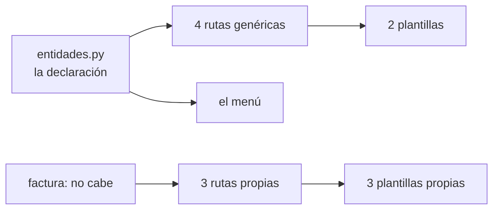

# Plan — Versión 6: el front declarativo

> **Versión 6** ([mapa](../0_mapa_versiones.md)) · Rige la
> [constitución](../../1_constitution.md). **Acumulativa:** la API v1–v4 y el
> front de la v5 **no se rompen** — la v6 extiende el front a las seis
> entidades.
>
> | Documento | Contenido |
> |---|---|
> | [2_spec.md](2_spec.md) | QUÉ agrega la v6 y sus criterios |
> | [3_plan.md](3_plan.md) | CÓMO: el front declarativo |
> | [4_research.md](4_research.md) | Las decisiones, con lo que se descartó |
> | [5_data_model.md](5_data_model.md) | El front sigue **sin datos propios** |
> | [6_contracts.md](6_contracts.md) | Las PANTALLAS de las seis entidades |
> | [7_quickstart.md](7_quickstart.md) | Arranque y smoke test |
> | [8_tasks.md](8_tasks.md) | El orden de construcción por fases |
> | [9_checklist.md](9_checklist.md) | La compuerta 3: se firma ANTES de programar |
> | [GUIA_IA6.md](GUIA_IA6.md) | Construirla con ayuda de una IA |

---

## 1. La estructura

```
front_flask/
├── app.py                        las vistas: 4 rutas genéricas + 4 de factura
├── entidades.py                  ← NUEVO: QUÉ tiene cada entidad
├── cliente_api.py                la clase Recurso + las funciones de factura
├── templates/
│   ├── base.html                 el marco y EL MENÚ
│   ├── entidades/                ← las cinco entidades comparten estas dos
│   │   ├── lista.html
│   │   └── formulario.html
│   └── facturas/                 ← factura tiene las suyas, y por una razón
│       ├── lista.html
│       ├── detalle.html
│       └── nueva.html
└── static/estilos.css
```

## 2. La decisión que ordena todo: declarar en vez de repetir

Cinco entidades con el mismo CRUD podían resolverse de dos maneras:

| | Copiar las pantallas | **Declarar la entidad** |
|---|---|---|
| Archivos | 10 plantillas casi iguales | **2** |
| Cambiar cómo se ve un error | en 10 sitios | en 1 |
| Agregar una entidad | escribir 2 plantillas y 4 rutas | **agregar un objeto** |
| Riesgo | olvidar uno y que quede distinto | ninguno |

Se eligió declarar. `entidades.py` describe cada una —sus campos, sus
etiquetas, cuáles son llaves foráneas, si su llave se digita— y `app.py`
recorre esa declaración.

> **Cuidado con leer esto al revés.** `entidades.py` **no es una capa de
> negocio**: no decide nada, solo describe la forma que la API ya declaró en
> sus modelos Pydantic. Si dijera algo distinto de lo que dice la API, **la
> que manda es la API** y este archivo estaría mal.

## 3. Y la decisión que la limita: factura NO cabe

Cinco entidades caben en el patrón porque **la API les ofrece el mismo
contrato**. `factura` no:

| | producto · persona · empresa · cliente · vendedor | factura |
|---|---|---|
| GET lista | ✅ | ✅ |
| GET uno | ✅ | ✅ |
| POST | ✅ | ✅ (con detalle) |
| PUT | ✅ | ❌ |
| PATCH | ✅ | ❌ |
| DELETE | ✅ | ❌ |
| Otro | — | **POST /anular** |

Se pudo haber forzado —una entidad "especial" con banderas en la
declaración—. **Se descartó**: las banderas habrían dicho que factura es un
CRUD con excepciones, cuando es otra cosa. Sus tres plantillas propias dicen
la verdad, y el que las lee entiende de una por qué.



## 4. Las decisiones de detalle

### 4.1 La clase `Recurso`

Seis entidades por seis operaciones darían 36 funciones idénticas salvo el
nombre. Una clase con cinco instancias dice lo mismo en un sexto del código —
y **factura queda por fuera a propósito**, con funciones sueltas.

### 4.2 El menú sale de la declaración

`@app.context_processor` inyecta las entidades en todas las plantillas. Una
lista escrita aparte en `base.html` sería otra cosa que hay que acordarse de
actualizar.

### 4.3 El opcional vacío se omite

```python
datos = {k: v for k, v in datos.items()
         if v != "" or _es_obligatorio(definicion, k)}
```

Enviar `""` es decir "ponlo en cadena vacía"; **omitirlo** es decir "no lo
tiene". La API lo guarda como `null`, que es lo correcto.

### 4.4 Los `<select>` de las llaves foráneas también se piden a la API

El front no tiene de dónde más sacarlos. Cargar el formulario de cliente hace
**tres** llamadas: ninguna a la base.

## 5. Chequeo de constitución

| Artículo | ¿Se respeta? | Cómo |
|---|---|---|
| 1 — No anticipar | ✅ | Sin login, sin búsqueda, sin paginación |
| 2 — SQL a la vista | ✅ | El front **no escribe SQL**: no tiene acceso |
| 3 — Capas con interfaces | ✅ | Vistas ↔ `cliente_api`. La declaración no es una capa |
| 4 — Un solo comando | ✅ | Sigue siendo `up -d --build` |
| 5 — La base es dada | ✅ | La v6 no la toca |
| 6 — Los contratos al pie de la letra | ✅ | **Y por eso factura no entra al patrón** |
| 7 — Secretos | ✅ | Como en la v5 |
| 8 — Todo en español | ✅ | Incluidas las etiquetas de la declaración |

**Ningún artículo obliga a cambiar el plan.** La compuerta pasa.
