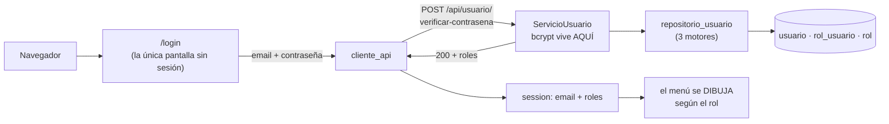

# Especificación — Versión 7: el sistema pide identificarse

> **Versión 7** ([mapa](../0_mapa_versiones.md)) · Rige la
> [constitución](../../1_constitution.md). **La primera versión que TOCA LA
> API** desde que nació el front: hasta la v6 solo se le agregaban clientes;
> aquí la API estrena una entidad.
>
> | Documento | Contenido |
> |---|---|
> | [2_spec.md](2_spec.md) | QUÉ agrega la v7 y sus criterios |
> | [3_plan.md](3_plan.md) | CÓMO: dónde vive cada pieza de la autenticación |
> | [4_research.md](4_research.md) | Las decisiones, con lo que se descartó |
> | [5_data_model.md](5_data_model.md) | Las tablas que llevaban 6 versiones dormidas |
> | [6_contracts.md](6_contracts.md) | Los endpoints y las pantallas |
> | [7_quickstart.md](7_quickstart.md) | Arranque y smoke test |
> | [8_tasks.md](8_tasks.md) | El orden de construcción por fases |
> | [9_checklist.md](9_checklist.md) | La compuerta 3: se firma ANTES de programar |
> | [GUIA_IA7.md](GUIA_IA7.md) | Construirla con ayuda de una IA |

---

## 1. Propósito

Hasta la v6, **cualquiera que abriera el navegador lo veía todo**. La v7 le
pone una puerta al sistema: hay que entrar con un correo y una contraseña, y
el menú se dibuja según los roles de quien entró.

Es la primera versión que **abre una entidad nueva en la API**. Y no es una
excepción a la regla del proyecto: es su consecuencia. Desde la v5 estaba
escrito que no había login **porque la API no exponía `usuario`** (D4 de la
v5). Lo que faltaba no era una pantalla: **faltaba el endpoint**. Ponerlo es
una versión propia, con su spec y su decisión — no un pedazo colgado de otra.

## 2. Alcance

**Incluye**

- **En la API**: la entidad `usuario` completa —CRUD— más
  `POST /api/usuario/verificar-contrasena`, en **los tres motores**.
- **Contraseñas cifradas con bcrypt**: todo lo que esta API escriba va con
  hash. La API **nunca devuelve** la contraseña, ni en claro ni cifrada.
- **En el front**: `/login`, `/logout`, y **toda otra ruta exige sesión**.
- El **menú filtrado por rol**, y quién está dentro visible en la barra.

**NO incluye** — y está dicho a propósito

- **Permisos de verdad.** El menú **dibuja**, no protege: quien escriba una
  URL a mano la ve igual. Ver [4_research §D3](4_research.md).
- El CRUD de `rol` y `ruta`, ni asignar roles o permisos: v8.
- JWT ni tokens: la sesión es la de Flask (D2).
- Registro público, recuperación de contraseña, expiración de sesión.

## 3. Requisitos funcionales

### RF1 — La API estrena `usuario`
`GET /api/usuario` (204 si vacío), `GET /api/usuario/{email}` —que devuelve
**el correo y sus roles**—, `POST`, `PUT`, `PATCH` y `DELETE`.
**El listado no incluye la contraseña**, ni el hash.

### RF2 — Verificar credenciales
`POST /api/usuario/verificar-contrasena` con `{email, contrasena}`:
- **200** → `{email, roles: [...]}`
- **401** → la contraseña no coincide
- **404** → el usuario no existe
- **422** → el email no tiene forma de email

### RF3 — Las contraseñas se guardan cifradas
`POST` y `PUT/PATCH` cifran con **bcrypt** antes de escribir. En la base
queda un hash, comprobable mirándola.

### RF4 — Entrar
`/login` valida contra la API. Al entrar, la sesión guarda **el correo y los
roles**, y nada más. Un fallo devuelve el formulario **con el correo puesto**
y la contraseña en blanco.

### RF5 — El front no distingue 401 de 404
Aunque la API sí los distingue, la pantalla dice **"Credenciales inválidas"**
en los dos casos. Decir "ese correo no existe" es confirmar cuáles sí existen.

### RF6 — Toda ruta exige sesión
Menos `/login` y `/logout`. Sin sesión, cualquier ruta redirige al login con
un aviso. Se resuelve con **un decorador**, no con un `if` copiado en cada
vista: a una vista se le puede olvidar el `if`, y queda abierta sin que nadie
lo note.

### RF7 — Salir
`/logout` borra la sesión y vuelve al login.

### RF8 — El menú se dibuja según el rol
`usuario` y `vendedor` solo se le muestran al **Administrador**. Los demás no
los ven en el menú — **pero pueden llegar por la URL**, y eso está declarado
como límite conocido, no escondido.

## 4. Criterios de aceptación

1. **La API estrena la entidad**: `GET /api/usuario` responde y **no aparece
   la palabra `contrasena`** en la respuesta.
   `GET /api/usuario/admin@correo.com` devuelve sus roles.
2. **Los cuatro desenlaces de verificar**: 200 con roles · 401 con clave
   equivocada · 404 con usuario inexistente · 422 con un email mal formado.
3. **Lo nuevo se guarda cifrado**: crear un usuario y mirar la base — la
   columna tiene un hash `$2b$…`, no la contraseña. Y aun así se entra con
   ella.
4. **Sin sesión no hay sistema**: `/producto` y `/facturas` redirigen (302).
5. **Entrar y salir**: con credenciales correctas se entra y la barra muestra
   quién es y sus roles; `/logout` cierra y vuelve a pedir login.
6. **El front no delata usuarios**: una clave equivocada y un correo
   inexistente dan **el mismo mensaje** en pantalla.
7. **El menú cambia con el rol**: el Administrador ve **Usuarios** y el
   Cliente no. **Y el Cliente, escribiendo `/usuario`, la ve igual (200)** —
   el criterio comprueba el límite, no lo esconde.
8. **Sin API no se puede ni entrar**: con `api-facturas` apagada, el login
   responde *"El servicio no está disponible"*.

## 5. Clarificaciones

| # | La pregunta | La respuesta, con su razón |
|---|---|---|
| **C1** | **Los datos dados traen contraseñas MEZCLADAS**: unas con hash bcrypt y otras en texto plano (`jefe123`, `cli123`) | **Se aceptan las dos formas al verificar**, o media tabla no podría entrar. Pero **todo lo que la API escriba va cifrado**: los usuarios en claro son deuda, y desaparecen cuando alguien les cambie la contraseña. **No es una decisión de diseño: es una inconsistencia de los datos que hay que declarar en vez de tapar** |
| C2 | ¿Dónde vive bcrypt? | **En el servicio.** El controller solo habla HTTP y el repositorio solo habla con un motor. Un repositorio que supiera de bcrypt sería un repositorio con negocio adentro |
| C3 | ¿La API devuelve la contraseña? | **Nunca**, ni el hash. El listado ni siquiera la selecciona: lo que no se lee, no se filtra |
| C4 | ¿401 y 404 se le cuentan al usuario? | **No**: la pantalla dice lo mismo en los dos casos (RF5). Que la API los distinga por dentro es útil para depurar; contárselo a quien toca la puerta es regalar información |
| C5 | ¿Y si alguien escribe `/usuario` sin ser admin? | **La ve.** El menú dibuja, no protege. Está en los criterios **como criterio**, para que nadie crea que hay una seguridad que no existe |
| C6 | ¿El PATCH de usuario tiene sentido, si solo hay un campo? | **Sí, se mantiene separado del PUT.** Lo que los distingue no es cuántos campos hay hoy: es su semántica. El día que la tabla gane una columna, PUT seguirá exigiéndolo todo y PATCH no |
| C7 | ¿Se pueden borrar usuarios con roles? | **No**: la FK de `rol_usuario` lo impide y responde 500. La integridad la defiende la base |

## 6. Definición de TERMINADA

1. Los **8 criterios** pasan, corridos por una persona.
2. [9_checklist.md](9_checklist.md) firmada.
3. El front de la v6 **sigue funcionando** (con sesión).
4. Commit y **tag `v7`**.
