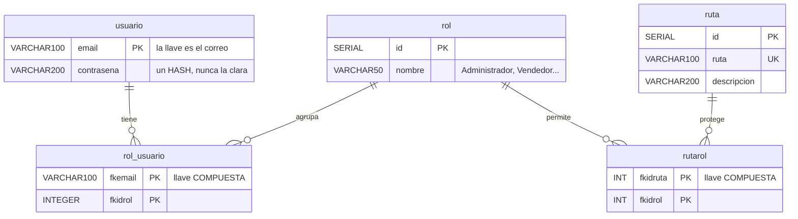

# Modelo de datos — Versión 7: las tablas que llevaban seis versiones dormidas

> **Versión 7** ([mapa](../0_mapa_versiones.md)) · Rige la
> [constitución](../../1_constitution.md). **La primera versión que TOCA LA
> API** desde que nació el front: hasta la v6 solo se le agregaban clientes;
> aquí la API estrena una entidad.
>
> | Documento | Contenido |
> |---|---|
> | [2_spec.md](2_spec.md) | QUÉ agrega la v7 y sus criterios |
> | [3_plan.md](3_plan.md) | CÓMO: dónde vive cada pieza de la autenticación |
> | [4_research.md](4_research.md) | Las decisiones, con lo que se descartó |
> | [5_data_model.md](5_data_model.md) | Las tablas que llevaban 6 versiones dormidas |
> | [6_contracts.md](6_contracts.md) | Los endpoints y las pantallas |
> | [7_quickstart.md](7_quickstart.md) | Arranque y smoke test |
> | [8_tasks.md](8_tasks.md) | El orden de construcción por fases |
> | [9_checklist.md](9_checklist.md) | La compuerta 3: se firma ANTES de programar |
> | [GUIA_IA7.md](GUIA_IA7.md) | Construirla con ayuda de una IA |

---

## 1. No se creó ni una tabla

Las cinco tablas de seguridad **están en la base desde la v1**, junto con las
otras siete. La v7 no las crea, no las altera: **las despierta**. Eso es el
Artículo 5 funcionando — la base es infraestructura dada, y las versiones van
nombrando pedazos de ella.

**La v7 usa tres**: `usuario`, `rol_usuario` y `rol` (para leer los roles).
`ruta` y `rutarol` **siguen dormidas**: son de la v8, la de los permisos.

## 2. Lo que hay sembrado, y su problema

| Usuario | Roles | Contraseña guardada |
|---|---|---|
| `admin@correo.com` | Administrador | hash `$2a$12$…` |
| `vendedor1@correo.com` | Vendedor, Cajero | hash `$2a$12$…` |
| `jefe@correo.com` | Administrador, Cajero, Contador | **`jefe123` EN CLARO** |
| `cliente1@correo.com` | Cliente | **`cli123` EN CLARO** |
| `nuevo@correo.com` | Administrador, Vendedor, Cajero | hash `$2a$11$…` |
| `test_encript@correo.com` | Administrador | hash `$2a$11$…` |
| (dos correos institucionales) | los cinco roles | hash `$2a$10$…` |

**Los datos dados son inconsistentes**, y esa es la clarificación C1 de esta
versión. No se corrigen con una migración que nadie pidió: se acepta la
realidad, se declara, y **todo lo nuevo se escribe cifrado**.

Los **cinco roles** sembrados: Administrador, Vendedor, Cajero, Contador,
Cliente.

## 3. Quién escribe qué

| Dato | Dueño | La API… |
|---|---|---|
| `usuario.email` | Quien crea el usuario | Lo escribe solo en el `POST` |
| `usuario.contrasena` | **El servicio** | Escribe **siempre un hash**. **Nunca lo devuelve** |
| `rol_usuario` | Nadie, en la v7 | Solo lo **lee** para saber los roles |
| `rol` | Nadie, en la v7 | Solo lo lee |
| `ruta`, `rutarol` | Nadie | No las nombra |

## 4. Invariantes

1. La columna `contrasena` **solo se lee** en `obtener_hash`, y ese valor no
   sale nunca de la API.
2. Todo lo que la API escriba en esa columna es un hash bcrypt.
3. La v7 no crea, altera ni borra objetos de la base.
4. Un usuario con roles asignados **no se puede borrar**: lo impide la FK.
